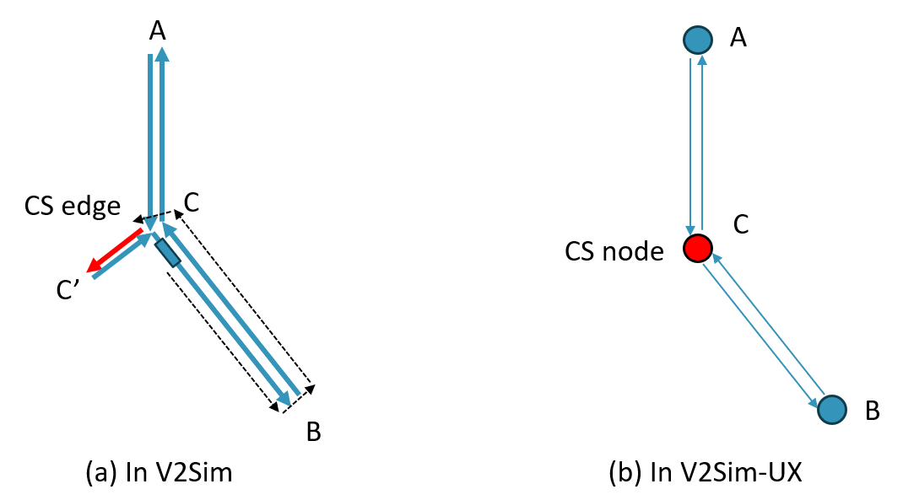

# Difference between different transportation simulators in V2Sim
1. **Trip**: In UXsim, a trip starts from a node and ends at another node, while in SUMO, a trips starts from the beginning of an edge and ends at the beginning of another edge.
2. **Simulation**: UXsim may split a case into multiple parts for **parallel simulation**, while SUMO is serial for a single case. Parallelism for SUMO can only be the simulation of multiple cases.
3. **Results**: Results of SUMO and UXsim can be very different since their different nature in trips. Generally, the distance covered by EV in UXsim will be smaller than that in SUMO.

# Results comparison
Here we compare the results of the 12-node case and 37-node case .

##### 12-node case
+ Vehicles: 10000 EVs
+ FCS: 
    + SUMO: Add an extra node and two short edges for each node. One of the short edge is treated as FCS, 12 in total. 10 Chargers for each FCS.
    + UXsim: 1 FCS per node, 12 in total. 10 Chargers for each FCS.
+ SCS:
    + SUMO: 1 SCS per edge, 40 in total. 10 Chargers for each SCS.
    + UXsim: 1 SCS per node, 40 in total. 33 Chargers for each SCS.
+ Results:
|12-node|Avg dist per trip|Avg charging per EV|Avg consumption per EV|Max fast charging power|Max slow charging power|
|---|---|---|---|---|---|
|SUMO|17.5km|16.8kWh|18.0kWh|6.5MW|2.2MW|
|UXsim|9.6km|10.6kWh|7.7kWh|6.4MW|2.3MW|

##### 37-node case
+ Vehicles: 10000 EVs
+ FCS: 
    + SUMO: Add an extra node and two short edges for each node. One of the short edge is treated as FCS, 37 in total. 10 Chargers for each FCS.
    + UXsim: 1 FCS per node, 37 in total. 10 Chargers for each FCS.
+ SCS:
    + SUMO: 1 SCS per edge, 130 in total. 10 Chargers for each SCS.
    + UXsim: 1 SCS per node, 130 in total. 35 Chargers for each SCS.
+ Results:
|37-node|Avg dist per trip|Avg charging per EV|Avg consumption per EV|Max fast charging power|Max slow charging power|
|---|---|---|---|---|---|
|SUMO|28.2km|27.6kWh|29.5kWh|6.5MW|6.3MW|
|UXsim|14.9km|17.7kWh|15.3kWh|6.0MW|6.6MW|

Results turn out that the distance coverd in SUMO is nearly twice the distance in UXsim, and thus lead to difference in charging and discharging energies.

## Possible reasons

Let's assume that some EV is departing nearly the beginning of edge CB (or node C in UXsim) and bound for a charging station at edge CC' (or node C in UXsim). The route it will goes through will be very different.

In SUMO, the EV has to cover CB and BC to arrive at the beginning of CC' (edge CC' will not be coverd since the EV ends at the edge's beginning).

In UXsim, the EV even do not need to move since the departure node is exactly the CS node.

From the comparison above, we may find that why UXsim distance are quite shorter than SUMO.