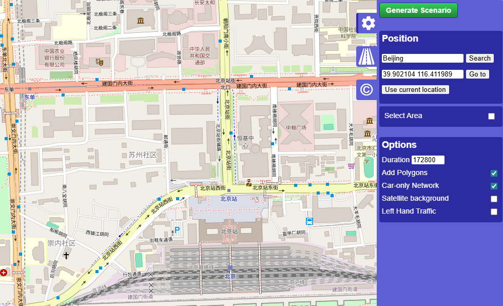
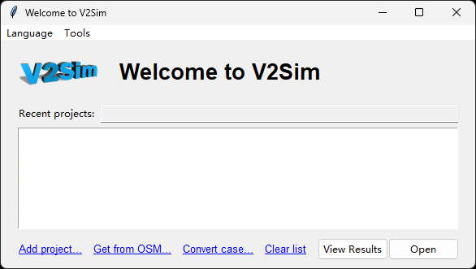
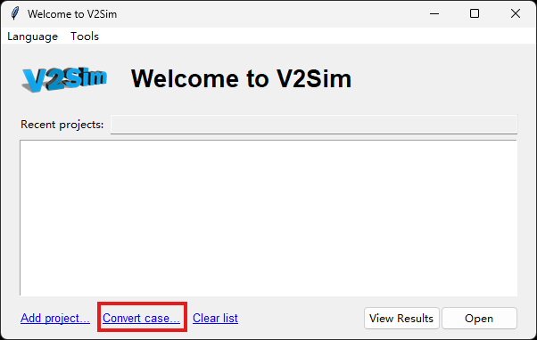
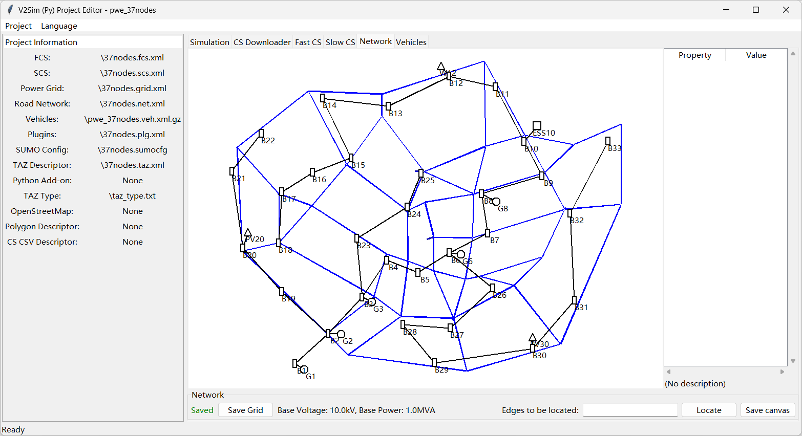

# Download and Edit Networks

## Download Transportation network
<!-- tabs:start -->
# **V2Sim**
Run the following command to open the transportation network downloader:
```
v2sim-osm
```
Your browser will be opened and a map will be displayed after running this script.
This program is based on OpenStreetMap. Due to network restrictions, **users in China Mainland** may not able to visit OpenStreetMap.



+ You can input a city name and click `Search` to turn to it, or you can input the latitude and longitude and click `Go to`. `Use current location` may not work due to the restriction of network and modern browser.
+ By default, the whole map shown in your screen will be downloaded. You can tick the checkbox `Select area` to only select a rectangle area. 
+ You can adjust items `Options` by your preference.
  - `Add Polygons` is recommended since polygons are used in EVCS and trip generation.
  - `Car-only Netowrk` is recommended since V2Sim/V2Sim-UX do not simulate objects other than vehicles.
+ In the second tab, only `highway` is ticked by default. Other options are not recommended since V2Sim will not simulate their motion.
+ Click the `Generate Scenario` button after proper configuration. The case will be generated in `cases` folder with a name of current time. V2Sim/V2Sim-UX GUI will automatically open after the case is generated. It looks like the following image: <br> 
+ If the generated case is not selected automatically, click the `Add project...` link, select the folder you have created, and then open it. You will see something like this: <br> 

Note: If you want to alter the road network, please use `netedit` of SUMO. You can use command `netedit` in your command prompt to start the program if Python has been added to the environment variable `PATH`.

# **V2Sim-UX**

Currently, V2Sim-UX cannot directly download a transportation network from OpenStreetMap. You can done it with V2Sim's `v2sim-osm`, and then convert a V2Sim case to a V2Sim-UX case. 

+ **Case Conversion Tutorial**

1. Run the following command to open the GUI, and then click `Convert case...`:



2. Select the input case folder and output folder, then click `Convert`:


<!-- tabs:end -->

### Edit Transportation Network
<!-- tabs:start -->
# **V2Sim**
Editing road network is not available in V2Sim GUI. Please use SUMO NetEdit by command `netedit`. In NetEdit, open the `.net.xml` or `.net.xml.gz` file to edit the road network.

# **V2Sim-UX**
You can directly drag the road network elements to edit them in V2Sim-UX GUI. The operation is the same as the operations introduced in the next section: Edit PDN.
<!-- tabs:end -->


### Edit Power Distribution Network (PDN)
There is no need for downloading PDN. For a newly-created case, an IEEE 33-node PDN is automatically added. You have to drag the items to place them in proper positions in `Network` page in GUI. 

The roads elements are in blue (V2Sim) or in colors (V2Sim-UX), while the PDN components are in black.

+ Left click on them to view its property in the sidebar on right.
+ Properties showed in the sidebar may be edited by double click. Note that not all the properties are editable.
+ Hold the mouse's right button to pan. 
+ Hold the mouse's left button and pan to move the elements.

**Legend:**
+ Black lines are transmission lines.
+ Black circles are generators.
+ Black rectangles are buses.
+ Black squares are energy storage systems.
+ Black triangles are wind turbines or photovoltaic systems.

Currently, it is not able to add or remove elements in the GUI. Please directly edit the PDN file and the road network file to achieve this.



