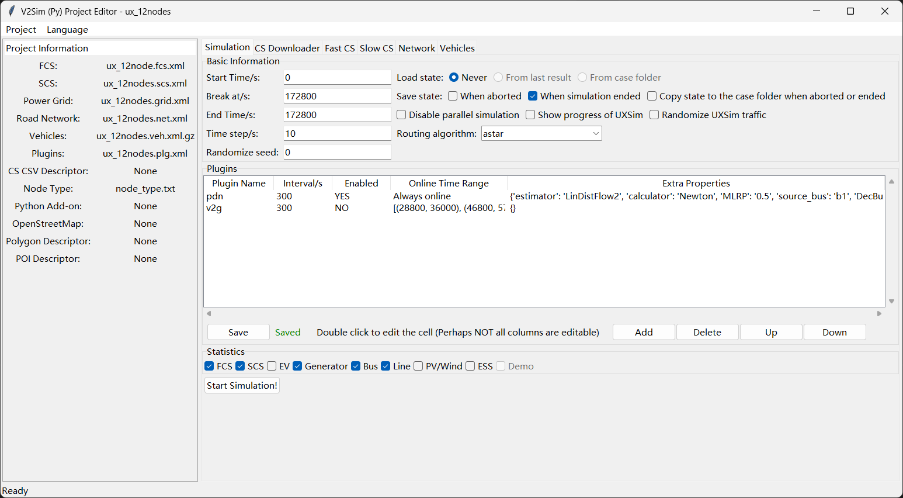

# Simulation
Back to the first page `Simulation`, you can set the parameters of simulation. 

<!-- tabs:start -->

# **V2Sim**

# **V2Sim-UX**

<!-- tabs:end -->

+ **Start Time**: The start time of simulation.
+ **End Time**: The end time of simulation.
+ (V2Sim-UX only) **Break at**: The actual end time of simulation. This parameter is used for resume simulation from saved states. For V2Sim-UX, when loading a saved states, its parameters cannot be modified.
+ **Time step**: The simulation step for V2Sim.
+ **Randomize seed**: Randomization seed for V2Sim. Theoretically, same seed will produce same results.
+ **Load state**: Whether load an existing saved state
    - Never: Do not load any state.
    - From last result: Load state saved in last simulation (`<case folder>/results/saved_state`).
    - From case folder: Load state saved in case folder (`<case folder>/saved_state`).
+ **Save state**: Select the occasion for saving states
    - When aborted: When the simulation is aborted by Ctrl+C.
    - When simulation ended: When the simulation ends normally.
    - Copy state to the case folder when aborted or ended: Copy the state folder from `<case folder>/results/saved_state` to `<case folder>/saved_state` when simulation ended or aborted.

+ (V2Sim only) **Force to use routing cache**

+ (V2Sim only) **Visualize road network**: Tick this option to show SUMO GUI when simulation. **Remember to click the "Play" button in toolbar in SUMO GUI to start simulation!**

+ (V2Sim-UX only) **Disable parallel simulation**: When you are using Python 3.14t for parallel V2Sim-UX, you can force it behave like the non-parallel V2Sim-UX by ticking this option.

+ (V2Sim-UX only) **Show progress of UXSim**: Tick this option to show the progress of UXSim instead of V2Sim-UX.

+ (V2Sim-UX only) **Randomize UXSim traffic**: Tick this option to use non-deterministic flow merging in UXSim.

+ **Routing algorithm**: The algorithm used for finding a route between the origin and the destination. Candidates are: `dijkstra` and `astar`, for V2Sim, `CH` and `CHWrapper` are additional candidates.

+ **IMPORTANT NOTE**: The parameters in `Basic Information `will not be saved until `Start Simulation!` is clicked! The `Save` button in `Plugins` just save the plugin information.

If you are using `v2sim-gui` or `v2simux-gui`, please make sure the `FCS`, `SCS`,` Road Network`, and `Vehicles` are not `None` in the left column. Then go back to `Simulation` page, tick your desired statistic items, and click `Start Simulation!`.

The window will shut down once you clicked `Start Simulation!`. Please wait patiently during simulation. It may cost several hours when simulate a large real-world network. You can watch the progress and estimated time required displayed in the command prompt.

## Multiple Cases Parallism
If you want to run several simulation parallelly (which can fully utilize your CPU), you can use `gui_para.py`. This function is quite useful 
when you want to change a specific parameter to measure its implication. Like the following image:

