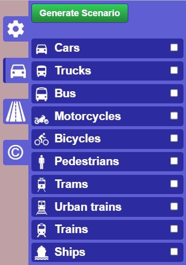

# Create a case
In this section, we will introduce how to create a road network from `gui_osmWizard.py`. This function requires network connection.

## Introduction
`gui_osmWizard.py` is a tool adapted from SUMO OSM Web Wizard. It can capture road network from OpenStreetMap. Use command `python gui_osmWizard.py` to execute it.

**Note**: Due to network restrictions, **users in China Mainland** may not able to visit OpenStreetMap.

## Locate your desired area

You can input the city name or use latitude and longitude to locate your desired area. By default, it will download the whole area you see. If you just want part of the area, tick `Select Area` and drag the box border to select your preferred area.

In the "Options" column, tick "Add Polygons" since they are used in EVCS and trip generation.

## Select proper edges
Only "highway" should be preserved. Preserve other way is unnecessary and may decrease the performance.

## Generate your case
Click the button "Generate Scenario" to create your case. The case will be generated in the `cases` folder in your downloaded source code. `gui_main.py` will automatically open and select your case just created.

