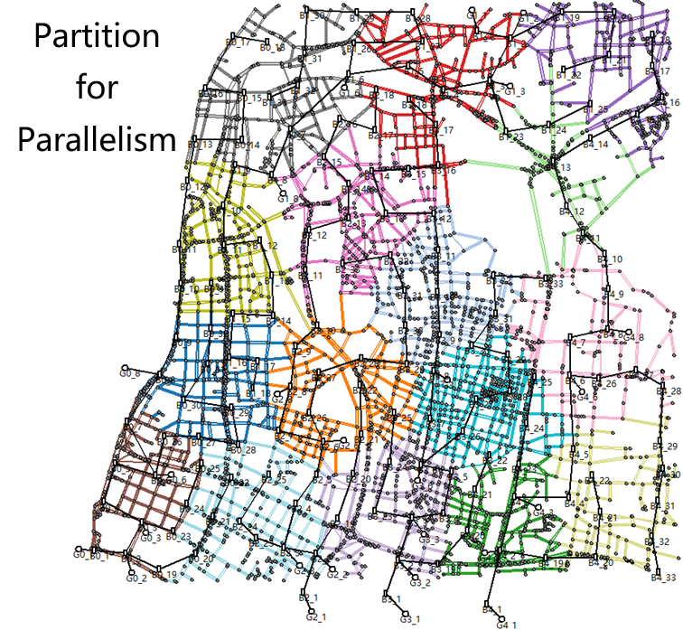

# V2Sim-UX

Link of code: https://github.com/hesl-seu/v2sim/tree/uxsim

This page is for V2Sim-UX, a **mesoscopic** open-Source V2G simulation platform for coupled urban power and transportation network. For V2Sim, please visit [here](v2sim/).

The transportation part of V2Sim is based on UXSim. Please visit [their website](https://github.com/toruseo/UXsim) for more details on traffic flow simulation.

Most components of V2Sim-UX are quite similar to V2Sim. You can refer to V2Sim documents. For the major differences, please read the next section.

## Difference between V2Sim-UX and V2Sim
1. **Trip**: In V2Sim-UX, a trip starts from a node and ends at another node, while in V2Sim, a trips starts from the beginning of an edge and ends at the beginning of another edge.
2. **Simulation**: V2Sim-UX may split a case into multiple parts for **parallel simulation**, while V2Sim is serial for a single case. Parallelism for V2Sim can only be the simulation of multiple cases.
3. **Results**: Results of V2Sim and V2Sim-UX can be very different since their different nature in trips. Generally, the distance covered by EV in V2Sim-UX will be smaller than that in V2Sim. Read [this page](/v2simux/res-cmp) for details.



## Cite V2Sim-UX
If you are using or V2Sim-UX, please cite our article: V2Sim: An Open-Source Microscopic V2G Simulation Platform in Urban Power and Transportation Network. Paper link: https://ieeexplore.ieee.org/document/10970754

BIB format:
```
@ARTICLE{10970754,
  author={Qian, Tao and Fang, Mingyu and Hu, Qinran and Shao, Chengcheng and Zheng, Junyi},
  journal={IEEE Transactions on Smart Grid}, 
  title={V2Sim: An Open-Source Microscopic V2G Simulation Platform in Urban Power and Transportation Network}, 
  year={2025},
  volume={16},
  number={4},
  pages={3167-3178},
  keywords={Vehicle-to-grid;Partial discharges;Microscopy;Batteries;Planning;Discharges (electric);Optimization;Vehicle dynamics;Transportation;Roads;EV charging load simulation;microscopic EV behavior;vehicle-to-grid;charging station fault sensing},
  doi={10.1109/TSG.2025.3560976}}
```