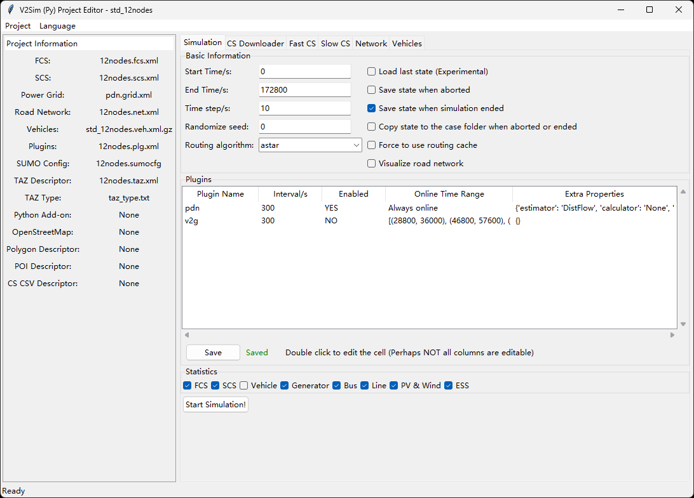
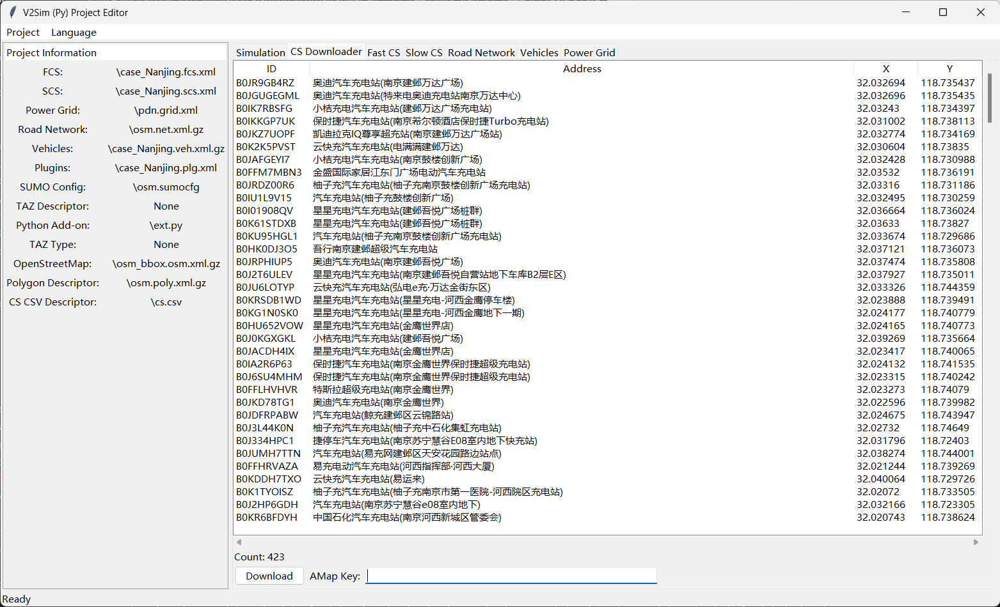
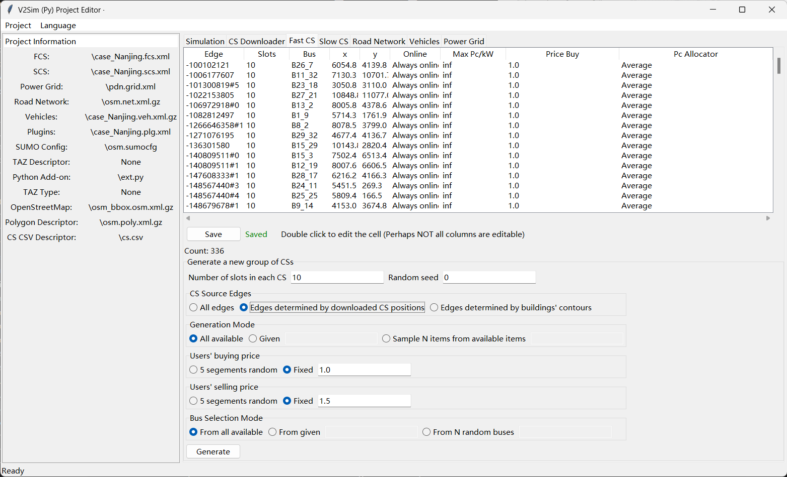
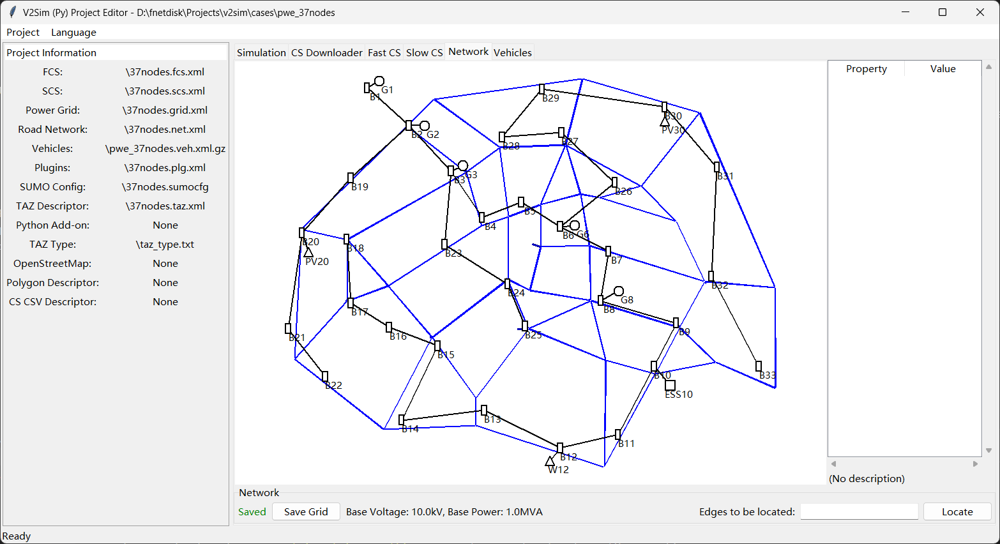
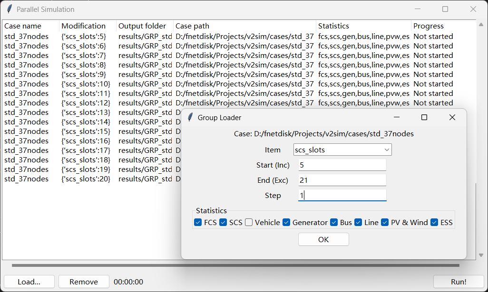
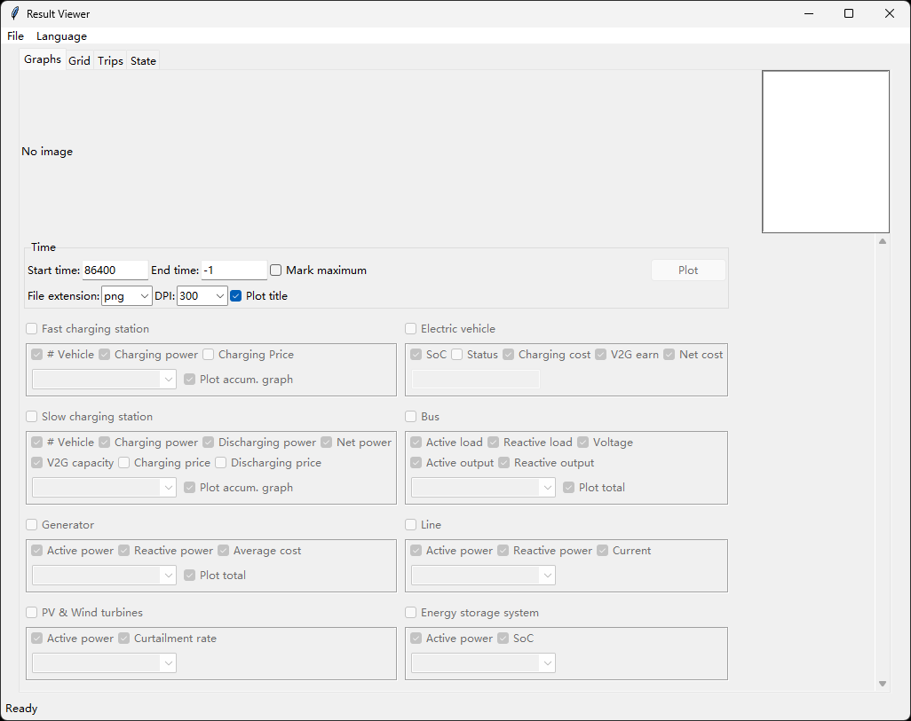
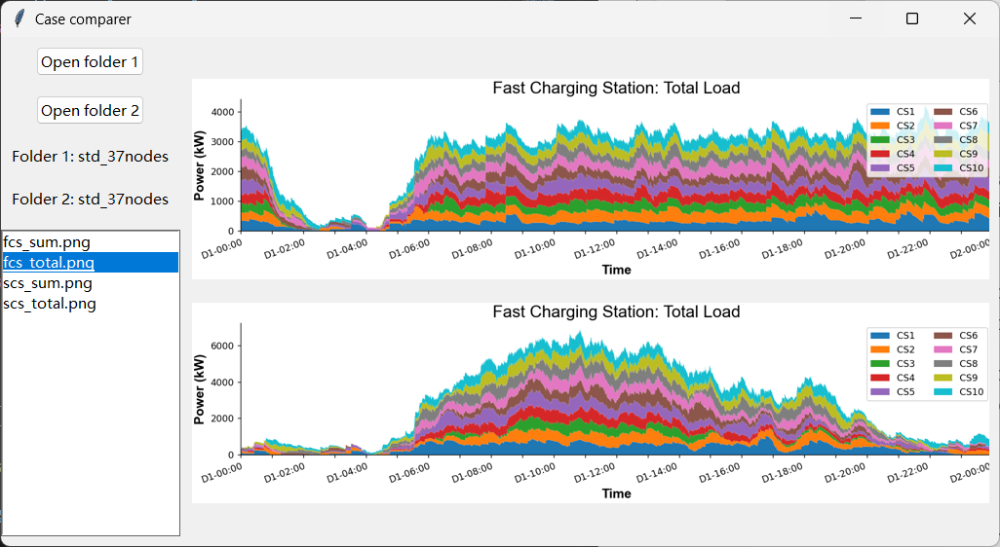
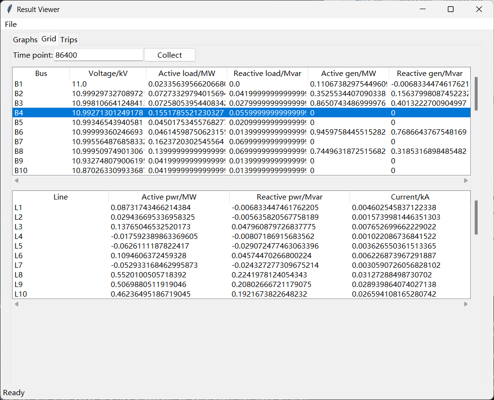
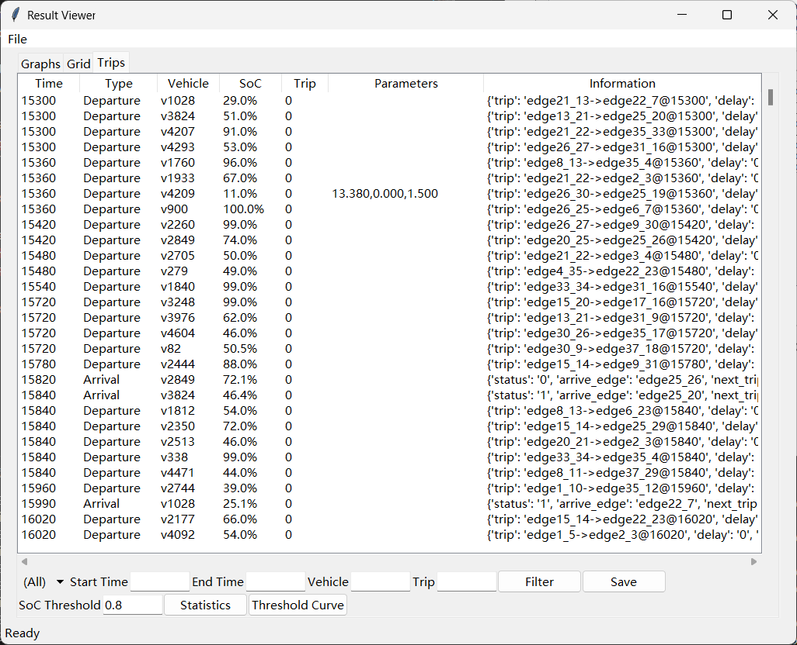
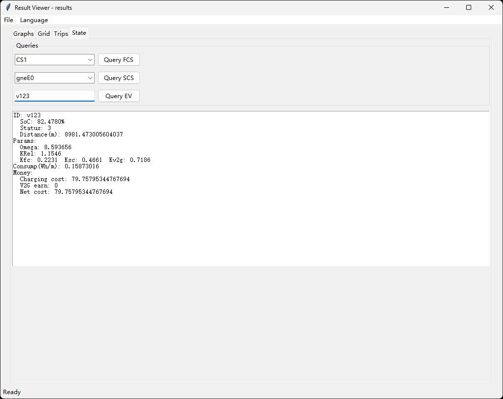

# Quick Start

## A. Setup the environment

1. Setup **Free-threading** Python 3.14: Visit `https://www.python.org/download` to get Python. Note that you have to tick the box of `download free-threading binaries` when installing Python 3.14. If you do not want to use parallel acceleration, the minimal version required is Python 3.9.

2. **Download this repo**. You can directly download this repo by clicking the `download` button on this page. Or you can setup `git` and clone this repo by the following command. The official tutorial about using `git` is [here](https://git-scm.com/book/en/v2/Getting-Started-Installing-Git).
```bash
git clone -b uxsim https://github.com/fmy-xfk/v2sim.git
```

3. **Create a `venv` virtual environment**. You can use the following command or IDE to accomplish this, but do **NOT** install any packages from `requirements.txt` or `pyproject.toml` at this step.
```bash
cd v2sim
# For free-threading Python 3.14, run this command to create
python3.14t -m venv ./.venv
# For normal Python, run this command to create
python -m venv ./.venv
```
4. **Activate virtual environment**. Select proper script according to your situation. After entering the virtual environment, run `Python` and ensure it containing messages like `free threading` if you want to use 
```bash
# Windows CMD
./.venv/Scripts/activate.bat
# Windows Powershell
./.venv/Scripts/activate.ps1
# Linux/MacOS
source ./.venv/bin/activate
```

5. **Install necessary packages**. Ensure you have installed `pip` together with Python. If you do not need parallel acceleration,you can directly install by `pip install -r requirements.txt`. For free threading Python 3.14, since it has just been released shortly before, some packages (like PyQt5) do not support it yet. Please use following commands:
```bash
python -m ensurepip
# For Windows with free threading Python 3.14
./install_deps.bat
# For Linux/MacOS with free threading Python 3.14
mv install_deps.bat install_deps.sh
chmod u+x install_deps.sh
./install_deps.sh
```

## B. Create a case
There are 3 pre-defined cases in the `cases` folder. You can exploit the 3 cases directly, or create a new case from scratch.

If you have an existing v2sim (microscopic version with) case, you can use `convert_case.py -i <old_case_folder> -o <new_case_folder>` to convert it. Vehicles, charging stations will not be preserved.

The following is a full tutorial for creating a case:

1. Download transportation network: 

(to be added)

Copy your case generated with OSMWebWizard to a proper place. Then run `gui_main.py` in the command prompt by:
```bash
python gui_main.py
```
* **Notice:** Double click to open this file is **NOT** recommended since many users have reported it doesn't work as expected.

Click the `Add existing project` link and click `Open` to load the folder you have created. You will see something like this:


2. Download charging station positions: If the area you downloaded is in **China Mainland**, you can download charging station positions in this program. Otherwise, please skip this step.
+ Switch to `CS Downloader` page and type an AMap(Chinese: 高德地图) developer key in the given input box. **ATTENTION: You must apply for a key for web service (Chinese: Web服务) on the [AMap official site](https://lbs.amap.com/). This function will never work without a key.** 
+ Click `Download` to get CS positions from AMap. Please wait patiently while downloading the CS positions. If there are too many CSs in the given area, they may not be all downloaded due to the restriction of AMap.
+ A successful result is shown below (The address are all Chinese since they are located in China):



+ After download the CS positions, please close the project editor and reopen it to avoid any potential error in the editor.

3. Generate charging stations: Switch to `Fast CS` and `Slow CS` respectively to generate differnt types of charging stations. We strongly recommend you to generate CS from the downloaded positions if you are using a real-world road network. Click the `Generate` button to generate CS.

+ Do **NOT** click `Generate` repeatedly even if it seems not working. The progress will be shown in the command prompt instead of popping up another window.

+ **Generating Fast CS is neccessary**, while generating slow CS is not.

+ A successful result is like this:



4. **Edit network**: Switch to `Network` page to view the road netowrk (in non-black color) and distribution network (in black). Hold the mouse's right button to pan. Network can be dragged and edited by left click.



(Slim rectangle = Bus, Triangle = PV / Wind turbine, Square = Energy Stoarge, Circle = Generator)

5. **Generate vehicles**: Switch to `Vehicles` page to generate vehicles. We strongly recommend you to generate trips from the buildings' contours and types if you are using a real-world road network. 

+ Do **NOT** click `Generate` repeatedly even if it seems not working. The progress will be shown in the command prompt instead of popping up another window.

6. **Start simulation**: Make sure the `FCS`, `SCS`, `Road Network`, and `Vehicles` are not `None` in the left column. Then go back to `Simulation` page, tick your desired statistic items, and click `Start Simulation!`.


## C. Simulation
The window will shut down once you clicked `Start Simulation!`. Please wait patiently during simulation. It may cost several hours when simulate a large real-world network. You can watch the progress and estimated time required displayed in the command prompt.

If you want to run several simulation parallelly (which can fully utilize your CPU), you can use `gui_para.py`. This function is quite useful when you want to change a specific parameter to measure its implication. Like the following image:


### D. View the results
After the simulation is done, run `gui_viewer.py` and open the case. The results is in the case folder, with a subfolder named `results`. It will be something like this:



#### Plotting
Tick the items you want to draw the corresponding figures. Click the button `Plot` to draw figures. Figures of results will be stored in `results\<case_name>\figures`.

**NOTE:**  Some items may not be available becasuse the corresponding statistic item is not selected when configuring the project, and thus it is not produced. 

**Compare two results:** Use `gui_cmp.py` to show two results in the same page, which makes it easier for you to identify the difference. Just like the following image:



**Better Plotting:** The GUI version of plotting is quite limited. You can visit [Wiki](https://github.com/fmy-xfk/v2sim/wiki) for better plotting tools: `cmd_advplot.py` and `cmd_plot.py`. The former one provides highly-customizable plotting experience, while the latter one enables plotting for batch of result folders.

#### Grid Information
You can also collect the data of the power grid at a specific time in page `Grid`. Enter the time point and then click `Collect`.



#### Trips viewer
Trips are also counted in `Trips` page. You can filter them by giving the conditions in the bar attached to the bottom of the window. You can also save the filtered results to a specific file.



#### State viewer
If you have ticked "Save state ..." before simulation, the state will be saved in the result folder. You can go through the status of FCS, SCS, and EV in the page. 

