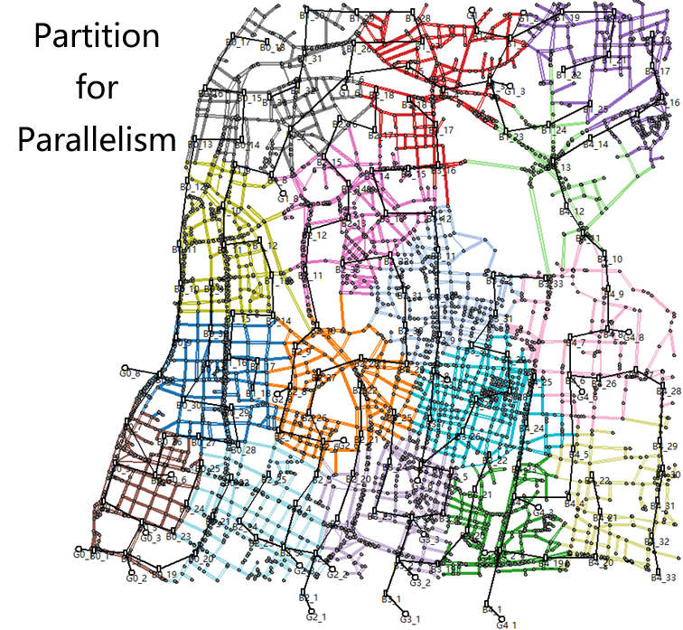

# V2Sim-UX 与 V2Sim 的区别

1.  **行程**：在 V2Sim-UX 中，一个行程从一个节点开始，到另一个节点结束；而在 V2Sim 中，一个行程从一条路段的起点开始，到另一条路段的起点结束。
2.  **仿真**：V2Sim-UX 可以将一个案例拆分成多个部分进行**并行仿真**，而 V2Sim 对于单个案例是串行的。V2Sim 的并行性只能是多个案例的仿真。
3.  **结果**：由于行程性质的不同，V2Sim 和 V2Sim-UX 的结果可能会有很大差异。通常，电动汽车在 V2Sim-UX 中行驶的距离会小于在 V2Sim 中行驶的距离。详情请阅读[此页面](/v2simux/res-cmp)。

# 结果比较

这里我们比较 12 节点案例和 37 节点案例的结果。

##### 12 节点案例
+ 车辆：10000 辆电动汽车
+ 快充站：
    + V2Sim：为每个节点添加一个额外节点和两条短路段。其中一条短路段作为快充站，共 12 个。每个快充站 10 个充电桩。
    + V2Sim-UX：每个节点 1 个快充站，共 12 个。每个快充站 10 个充电桩。
+ 慢充站：
    + V2Sim：每条路段 1 个慢充站，共 40 个。每个慢充站 10 个充电桩。
    + V2Sim-UX：每个节点 1 个慢充站，共 40 个。每个慢充站 33 个充电桩。
+ 结果：
| 12节点 | 每次行程平均距离 | 每辆电动汽车平均充电量 | 每辆电动汽车平均消耗量 | 最大快充功率 | 最大慢充功率 |
|---|---|---|---|---|---|
| V2Sim | 17.5 公里 | 16.8 千瓦时 | 18.0 千瓦时 | 6.5 兆瓦 | 2.2 兆瓦 |
| V2Sim-UX | 9.6 公里 | 10.6 千瓦时 | 7.7 千瓦时 | 6.4 兆瓦 | 2.3 兆瓦 |

##### 37 节点案例
+ 车辆：10000 辆电动汽车
+ 快充站：
    + V2Sim：为每个节点添加一个额外节点和两条短路段。其中一条短路段作为快充站，共 37 个。每个快充站 10 个充电桩。
    + V2Sim-UX：每个节点 1 个快充站，共 37 个。每个快充站 10 个充电桩。
+ 慢充站：
    + V2Sim：每条路段 1 个慢充站，共 130 个。每个慢充站 10 个充电桩。
    + V2Sim-UX：每个节点 1 个慢充站，共 130 个。每个慢充站 35 个充电桩。
+ 结果：
| 37节点 | 每次行程平均距离 | 每辆电动汽车平均充电量 | 每辆电动汽车平均消耗量 | 最大快充功率 | 最大慢充功率 |
|---|---|---|---|---|---|
| V2Sim | 28.2 公里 | 27.6 千瓦时 | 29.5 千瓦时 | 6.5 兆瓦 | 6.3 兆瓦 |
| V2Sim-UX | 14.9 公里 | 17.7 千瓦时 | 15.3 千瓦时 | 6.0 兆瓦 | 6.6 兆瓦 |

结果表明，V2Sim 中行驶的距离几乎是 V2Sim-UX 中行驶距离的两倍，因此导致了充电和放电能量的差异。

## 可能的原因

假设某辆电动汽车从路段 CB 的起点附近（或在 V2Sim-UX 中的节点 C）出发，前往位于路段 CC'（或在 V2Sim-UX 中的节点 C）的充电站。它将经过的路线会非常不同。

在 V2Sim 中，电动汽车必须行驶 CB 和 BC 才能到达 CC' 的起点（由于电动汽车在路段的起点结束，因此不会行驶 CC' 路段）。

在 V2Sim-UX 中，由于出发节点正是充电站节点，电动汽车甚至不需要移动。

从上面的比较中，我们可以发现为什么 V2Sim-UX 的距离比 V2Sim 短得多。