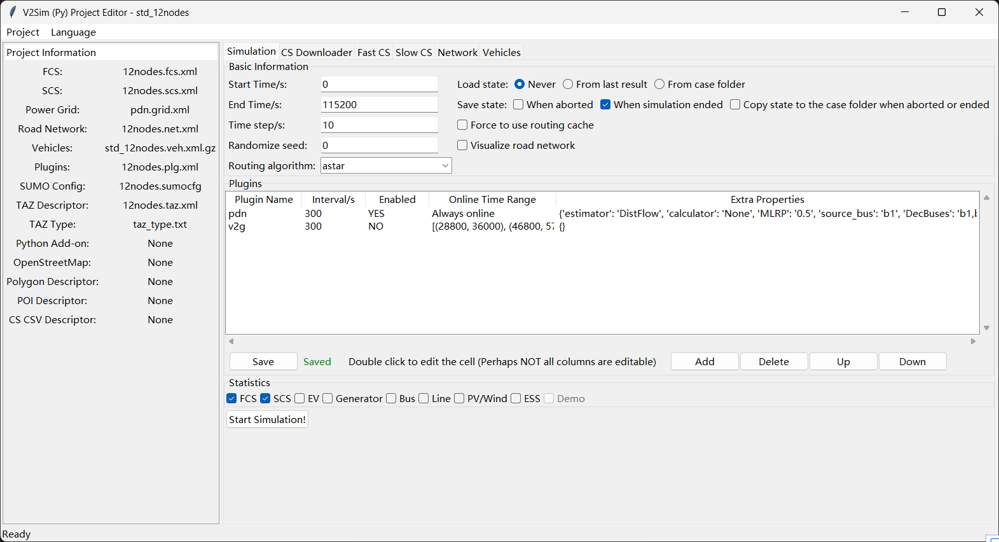
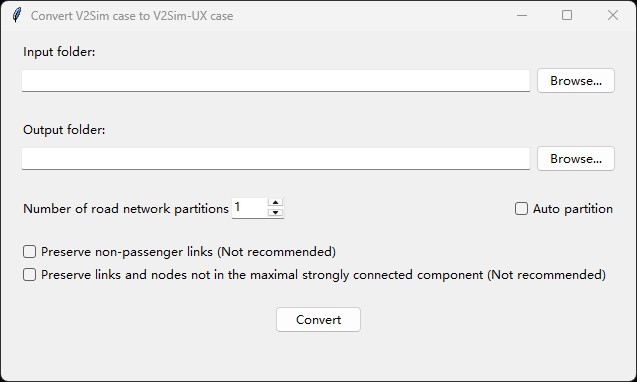

# 下载和编辑网络

## 下载交通网络
<!-- tabs:start -->
# **V2Sim**
运行以下命令打开交通网络下载器：
```
v2sim-osm
```
运行此脚本后，您的浏览器将打开并显示地图。
此程序基于 OpenStreetMap。由于网络限制，**中国大陆用户**可能无法访问 OpenStreetMap。


+ 您可以输入城市名称并点击 `Search` 跳转到该城市，或者输入经纬度并点击 `Go to`。由于网络和现代浏览器的限制，`Use current location` 可能无法工作。
+ 默认情况下，将下载屏幕上显示的整个地图。您可以勾选复选框 `Select area` 以仅选择矩形区域。
+ 您可以根据偏好调整 `Options` 项。
  - 推荐启用 `Add Polygons`，因为多边形用于电动汽车充电站和行程生成。
  - 推荐启用 `Car-only Network`，因为 V2Sim/V2Sim-UX 不模拟车辆以外的对象。
+ 在第二个标签页中，默认仅勾选 `highway`。不推荐其他选项，因为 V2Sim 不会模拟它们的运动。
+ 适当配置后点击 `Generate Scenario` 按钮。案例将在 `cases` 文件夹中生成，名称使用当前时间。案例生成后，V2Sim/V2Sim-UX GUI 将自动打开。它看起来像下图：<br> 
+ 如果生成的案例未被自动选中，点击 `Add project...` 链接，选择您创建的文件夹，然后打开它。您将看到类似这样的内容：<br> 

注意：如果您想修改道路网络，请使用 SUMO 的 `netedit`。如果 Python 已添加到环境变量 `PATH` 中，您可以在命令提示符中使用命令 `netedit` 启动程序。

# **V2Sim-UX**

目前，V2Sim-UX 无法直接从 OpenStreetMap 下载交通网络。您可以使用 V2Sim 的 `v2sim-osm` 完成此操作，然后将 V2Sim 案例转换为 V2Sim-UX 案例。

+ **案例转换教程**

1. 运行以下命令打开 GUI，然后点击 `Convert case...`：


2. 选择输入案例文件夹和输出文件夹，然后点击 `Convert`：



<!-- tabs:end -->

### 编辑交通网络
<!-- tabs:start -->
# **V2Sim**
V2Sim GUI 中无法编辑道路网络。请使用 SUMO NetEdit，通过命令 `netedit`。在 NetEdit 中，打开 `.net.xml` 或 `.net.xml.gz` 文件来编辑道路网络。

# **V2Sim-UX**
您可以直接在 V2Sim-UX GUI 中拖动道路网络元素来编辑它们。操作与下一节介绍的编辑配电网操作相同。
<!-- tabs:end -->

### 编辑配电网 (PDN)
无需下载配电网。对于新创建的案例，会自动添加一个 IEEE 33 节点配电网。您必须在 GUI 的 `Network` 页面中拖动项目以将它们放置在适当的位置。

道路元素为蓝色（V2Sim）或彩色（V2Sim-UX），而配电网组件为黑色。

+ 左键单击它们以在右侧边栏中查看其属性。
+ 边栏中显示的属性可以通过双击进行编辑。请注意，并非所有属性都可编辑。
+ 按住鼠标右键可以平移。
+ 按住鼠标左键并平移可以移动元素。

**图例：**
+ 黑线是输电线路。
+ 黑圈是发电机。
+ 黑矩形是母线。
+ 黑方块是储能系统。
+ 黑三角形是风力涡轮机或光伏系统。

目前，无法在 GUI 中添加或删除元素。请直接编辑配电网文件和道路网络文件来实现这一点。

