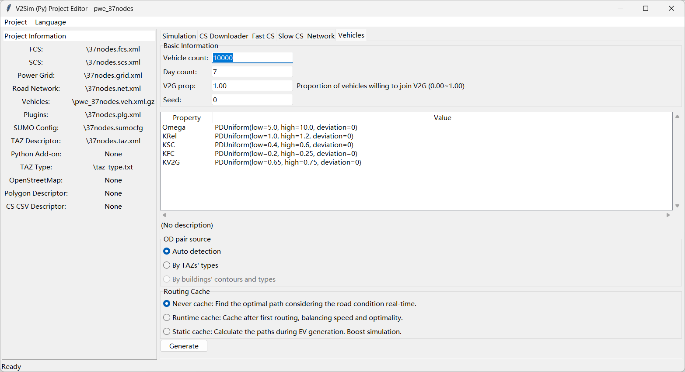

# 生成车辆

我们推荐您使用图形用户界面生成车辆，因为这简单直观。选择 `车辆` 标签页，您将转到车辆生成页面。切换到 `车辆` 页面以生成车辆。如果您使用的是真实世界的道路网络，我们强烈建议您根据建筑物的轮廓和类型生成行程。

您可以在 `基本信息` 面板中编辑车辆数量、天数、车对网比例和随机种子。
+ 车辆数量：将要生成的车辆（电动汽车）数量。
+ 天数：生成行程的天数。每天将为每辆车生成 3 个行程。**此外，使用的天数是输入数字加一！** 例如，如果天数为 7，则每辆车将生成 8 天的行程（总共 24 个行程）。因为仿真中的第一天通常是异常的，将被忽略。默认的绘图起始时间点也是第二天的开始。
+ **车对网比例**：愿意参与车对网的车辆比例。请注意，即使电动汽车愿意参与车对网，它也可能不会一直参与车对网放电。是否放电受多种因素影响：车对网收益、时间范围、中心调度命令等。
+ **种子**：用于生成的随机种子。如果所有参数（包括种子）完全相同，则程序将生成完全相同的车辆和行程。

中间的属性框显示几个关键参数，这些参数是电动汽车特有的。但是，逐辆车分配这些参数很不方便。因此，改用概率分布函数。双击编辑概率分布函数。
+ **Omega**：描述电动汽车用户单位时间价值的系数。
+ **KRel**：表示电动汽车用户的路线长度估计偏差。估计长度是 KRel × 实际长度。
+ **KSC**：触发慢充的荷电状态阈值。
+ **KFC**：触发快充的荷电状态阈值。
+ **KV2G**：触发车对网放电的荷电状态阈值。
通常，KV2G > KSC > KFC。

底部的单选按钮显示了对于起点-终点对来源和路由缓存的偏好。
+ 起点-终点对来源有 3 个选项：交通分析小区、轮廓和自动。
  - 交通分析小区模式需要一个 `taz_type.txt` 文件和一个 `*.taz.xml` 文件来指示交通分析小区的功能和所属路段。这些文件通常是在小型案例中手动创建的。
  - 轮廓模式需要一个 `*.poly.xml(.gz)` 文件来指示建筑物轮廓的多边形。此文件通常由 OSMWebWizard 生成。
  - 自动模式是根据案例中的文件在交通分析小区和轮廓之间进行选择。如果条件满足，则优先选择交通分析小区。
+ 路由缓存也有 3 个选项。它们的优缺点显示在图形用户界面中。(仅适用于V2Sim)