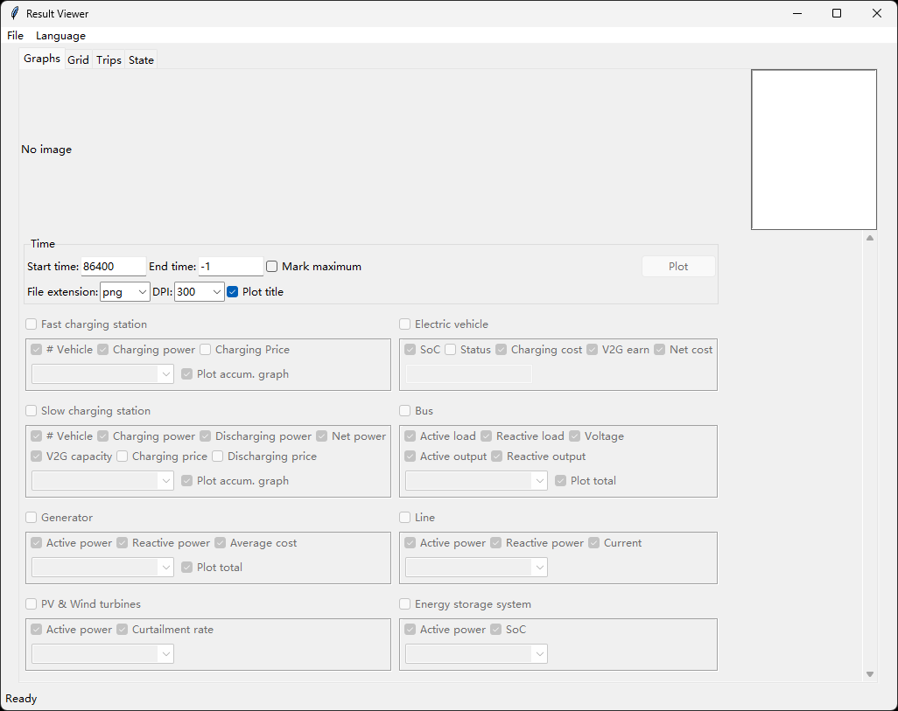
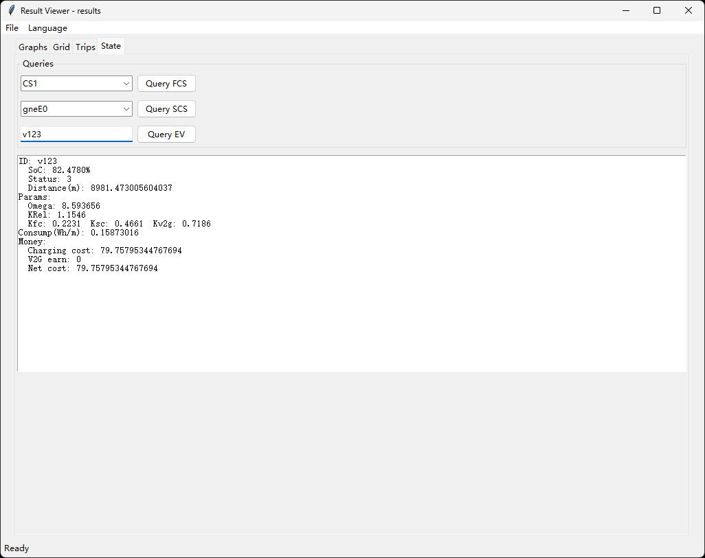

# 查看结果

仿真完成后，结果将存储在案例文件夹中，其中有一个名为 `results` 的子文件夹。运行 `v2sim-gui` 或 `v2simux-gui` 并选择您刚刚仿真的案例。然后点击 `查看结果`，将弹出一个新窗口显示结果。它看起来会像这样：

## 绘图
勾选您想要绘制相应图形的项目。点击 `绘图` 按钮来绘制图形。结果图形将存储在 `results\<案例名称>\figures` 中。

**注意：** 某些项目可能不可用，因为在配置项目时未选择相应的统计项，因此未生成该数据。

**比较两个结果：** 使用 `gui_cmp.py` 在同一页面显示两个结果，这使您更容易识别差异。就像下图所示：

**更好的绘图：** 图形用户界面版本的绘图功能相当有限。您可以阅读 `v2sim-advplot` 和 `v2sim-plot` 以获得更好的绘图体验。前者提供高度可定制的绘图体验，而后者支持对批量结果文件夹进行绘图。

## 电网信息
您还可以在 `电网` 页面收集特定时间点的电网数据。输入时间点，然后点击 `收集`。

## 行程查看器
行程也在 `行程` 页面进行统计。您可以通过在窗口底部附加的栏中给出条件来筛选它们。您还可以将筛选结果保存到特定文件。

## 状态查看器
如果您在仿真前勾选了"保存状态..."，状态将保存在结果文件夹中。您可以在该页面查看快充站、慢充站和电动汽车的状态。

