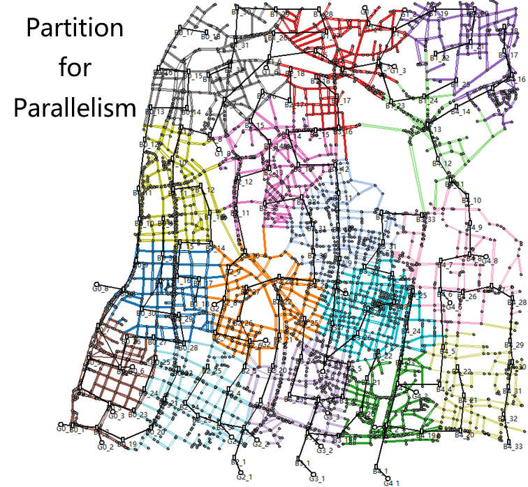

# V2Sim-UX

代码链接：https://github.com/hesl-seu/v2sim/tree/uxsim

本页面适用于V2Sim-UX：考虑车网互动(V2G)城市**中观**交通网与配电网耦联合仿真平台。如需使用V2Sim，请访问[此处](zh_hans/v2sim/)。

V2Sim 的交通部分基于 UXSim。请访问[其官方网站](https://github.com/toruseo/UXSim)获取关于交通流仿真的更多详细信息。

V2Sim-UX 的大多数组件与 V2Sim 非常相似。您可以参考 V2Sim 的文档。关于主要差异，请阅读下一节。

## V2Sim-UX 与 V2Sim 的差异

1. **行程**：在 V2Sim-UX 中，行程从一个节点开始，到另一个节点结束；而在 V2Sim 中，行程从一条边的起点开始，到另一条边的起点结束。

2. **仿真**：V2Sim-UX 可能将一个案例拆分为多个部分进行**并行仿真**，而 V2Sim 对单个案例是串行仿真的。V2Sim 的并行性仅限于多个案例的同时仿真。

3. **结果**：由于行程性质的不同，V2Sim 和 V2Sim-UX 的结果可能会有很大差异。通常，V2Sim-UX 中电动汽车的行驶距离会小于 V2Sim 中的行驶距离。详情请参阅[此页面](zh_hans/v2simux/res-cmp)。



## 引用V2Sim-UX
如果您正在使用V2Sim-UX，请引用我们的文章：V2Sim: An Open-Source Microscopic V2G Simulation Platform in Urban Power and Transportation Network
论文链接：https://ieeexplore.ieee.org/document/10970754

国标GB/T7714-2015引用格式：

>Qian Tao, Fang Mingyu, Hu Qinran, et al. V2Sim: An Open-Source Microscopic V2G Simulation Platform in Urban Power and Transportation Network[J]. IEEE Transactions on Smart Grid, 2025,16(4):3167-3178.

BIB格式：
```
@ARTICLE{10970754,
  author={Qian, Tao and Fang, Mingyu and Hu, Qinran and Shao, Chengcheng and Zheng, Junyi},
  journal={IEEE Transactions on Smart Grid}, 
  title={V2Sim: An Open-Source Microscopic V2G Simulation Platform in Urban Power and Transportation Network}, 
  year={2025},
  volume={16},
  number={4},
  pages={3167-3178},
  keywords={Vehicle-to-grid;Partial discharges;Microscopy;Batteries;Planning;Discharges (electric);Optimization;Vehicle dynamics;Transportation;Roads;EV charging load simulation;microscopic EV behavior;vehicle-to-grid;charging station fault sensing},
  doi={10.1109/TSG.2025.3560976}}
```