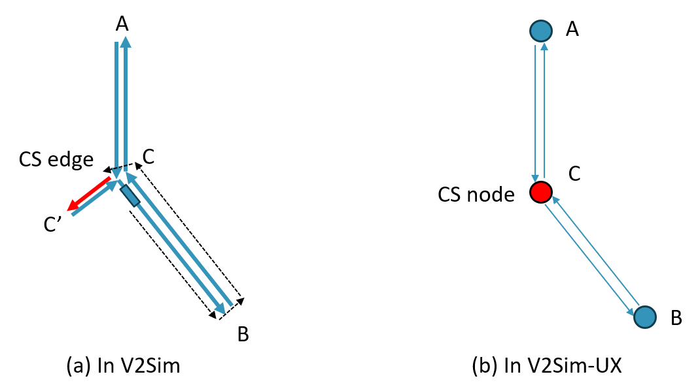

# V2Sim 与 V2Sim-UX 结果对比

这里我们对比 12 节点案例和 37 节点案例的结果。

##### 12 节点案例
+ 车辆：10000 辆电动汽车
+ 快充站：
    + V2Sim：为每个节点添加一个额外节点和两条短边。其中一条短边作为快充站，共 12 个。每个快充站 10 个充电桩。
    + V2Sim-UX：每个节点 1 个快充站，共 12 个。每个快充站 10 个充电桩。
+ 慢充站：
    + V2Sim：每条边 1 个慢充站，共 40 个。每个慢充站 10 个充电桩。
    + V2Sim-UX：每个节点 1 个慢充站，共 40 个。每个慢充站 33 个充电桩。
+ 结果：
|12节点案例|单次行程平均距离|单辆电动汽车平均充电量|单辆电动汽车平均耗电量|最大快速充电功率|最大慢速充电功率|
|---|---|---|---|---|---|
|V2Sim|17.5公里|16.8千瓦时|18.0千瓦时|6.5兆瓦|2.2兆瓦|
|V2Sim-UX|9.6公里|10.6千瓦时|7.7千瓦时|6.4兆瓦|2.3兆瓦|

##### 37 节点案例
+ 车辆：10000 辆电动汽车
+ 快充站：
    + V2Sim：为每个节点添加一个额外节点和两条短边。其中一条短边作为快充站，共 37 个。每个快充站 10 个充电桩。
    + V2Sim-UX：每个节点 1 个快充站，共 37 个。每个快充站 10 个充电桩。
+ 慢充站：
    + V2Sim：每条边 1 个慢充站，共 130 个。每个慢充站 10 个充电桩。
    + V2Sim-UX：每个节点 1 个慢充站，共 130 个。每个慢充站 35 个充电桩。
+ 结果：
|37节点案例|单次行程平均距离|单辆电动汽车平均充电量|单辆电动汽车平均耗电量|最大快速充电功率|最大慢速充电功率|
|---|---|---|---|---|---|
|V2Sim|28.2公里|27.6千瓦时|29.5千瓦时|6.5兆瓦|6.3兆瓦|
|V2Sim-UX|14.9公里|17.7千瓦时|15.3千瓦时|6.0兆瓦|6.6兆瓦|

结果表明，V2Sim 中的行驶距离几乎是 V2Sim-UX 中的两倍，因此导致了充放电能量的差异。

## 可能原因

假设某辆电动汽车从边 CB 的起点附近（或 V2Sim-UX 中的节点 C）出发，前往边 CC' 上的充电站（或 V2Sim-UX 中的节点 C）。它将经过的路线会有很大不同。

在 V2Sim 中，电动汽车需要经过 CB 和 BC 才能到达 CC' 的起点（由于电动汽车在边的起点结束，因此不会经过边 CC'）。

在 V2Sim-UX 中，由于出发节点正好是充电站节点，电动汽车甚至不需要移动。

从以上对比我们可以发现，为什么 V2Sim-UX 的行驶距离比 V2Sim 短得多。